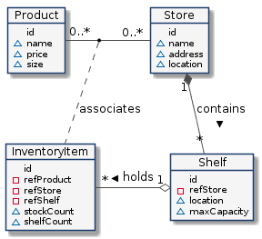

# 02Entity Relationship

<aside>
❗ Docker Version 20 이상
Docker Compose Version 2.5 이상
환경에서 진행됨

환경 구성은 01Getting Started와 같음

</aside>

## Entity 및 Relationship

간단한 재고 관리 시스템으로 네가지 유형의 엔티티정의

[](https://fiware-tutorials.readthedocs.io/en/1.0.0/entity-relationships/index.html)

- 상점은 실제 건물입니다. 상점 엔터티에는 다음과 같은 속성이 있습니다.
  - 상점 이름(예: "Checkpoint Markt")
  - 주소 "Friedrichstraße 44, 10969 Kreuzberg, Berlin"
  - 실제 위치(예: 52.5075 N, 13.3903 E)
- 선반은 우리가 팔고자 하는 물건을 담는 실제 장치입니다. 각 선반 엔터티에는 다음과 같은 속성이 있습니다.
  - 선반의 이름(예: "Wall Unit")
  - 물리적 위치(예: 52.5075 N, 13.3903 E)
  - 최대 용량
  - 선반이 있는 매장에 대한 연결
- 제품은 우리가 판매하는 것으로 정의되며 개념적 대상입니다. 제품 엔터티에는 다음과 같은 속성이 있습니다.
  - 제품 이름(예: "Vodka")
  - 가격(예: 13.99 유로)
  - 크기(예: Small)
- 인벤토리 항목은 제품, 상점, 선반 및 물리적 개체를 연결하는 데 사용되는 또 다른 개념적 엔터티입니다. 인벤토리 항목 엔터티는 다음과 같은 속성을 갖습니다.
  - 판매 중인 제품에 대한 연결
  - 제품이 판매되는 매장에 대한 연결
  - 제품이 표시되는 선반에 대한 연결
  - 창고에서 사용 가능한 제품
  - 선반에서 사용 가능한 제품 수량의 재고 수

## 01. Create Shelf Units

### Request

```bash
# 01CreateShelfUnits.http
curl -iX POST \
  'http://localhost:1026/v2/op/update' \
  -H 'Content-Type: application/json' \
  -d '{
  "actionType":"APPEND",
  "entities":[
    {
      "id":"urn:ngsi-ld:Shelf:unit001", "type":"Shelf",
      "location":{
        "type":"geo:json", "value":{ "type":"Point","coordinates":[13.3986112, 52.554699]}
      },
      "name":{
        "type":"Text", "value":"Corner Unit"
      },
      "maxCapacity":{
        "type":"Integer", "value":50
      }
    },
    {
      "id":"urn:ngsi-ld:Shelf:unit002", "type":"Shelf",
      "location":{
        "type":"geo:json","value":{"type":"Point","coordinates":[13.3987221, 52.5546640]}
      },
      "name":{
        "type":"Text", "value":"Wall Unit 1"
      },
      "maxCapacity":{
        "type":"Integer", "value":100
      }
    },
    {
      "id":"urn:ngsi-ld:Shelf:unit003", "type":"Shelf",
      "location":{
        "type":"geo:json", "value":{"type":"Point","coordinates":[13.3987221, 52.5546640]}
      },
      "name":{
        "type":"Text", "value":"Wall Unit 2"
      },
      "maxCapacity":{
        "type":"Integer", "value":100
      }
    },
    {
      "id":"urn:ngsi-ld:Shelf:unit004", "type":"Shelf",
      "location":{
        "type":"geo:json", "value":{"type":"Point","coordinates":[13.390311, 52.507522]}
      },
      "name":{
        "type":"Text", "value":"Corner Unit"
      },
      "maxCapacity":{
        "type":"Integer", "value":50
      }
    },
    {
      "id":"urn:ngsi-ld:Shelf:unit005", "type":"Shelf",
      "location":{
        "type":"geo:json","value":{"type":"Point","coordinates":[13.390309, 52.50751]}
      },
      "name":{
        "type":"Text", "value":"Long Wall Unit"
      },
      "maxCapacity":{
        "type":"Integer", "value":200
      }
    }
  ]
}'
```

### Response

```bash
# 01CreateShelfUnits.http
HTTP/1.1 204 No Content
Connection: close
Fiware-Correlator: cc828004-97d2-11ed-a6b2-0242ac120103
Date: Thu, 19 Jan 2023 08:25:14 GMT
```

## 02. Create Products

### Request

```bash
# 02CreateProducts.http
curl -iX POST \
  'http://localhost:1026/v2/op/update' \
  -H 'Content-Type: application/json' \
  -d '{
  "actionType":"APPEND",
  "entities":[
    {
      "id":"urn:ngsi-ld:Product:001", "type":"Product",
      "name":{
        "type":"Text", "value":"Beer"
      },
      "size":{
        "type":"Text", "value": "S"
      },
      "price":{
        "type":"Integer", "value": 99
      }
    },
    {
      "id":"urn:ngsi-ld:Product:002", "type":"Product",
      "name":{
        "type":"Text", "value":"Red Wine"
      },
      "size":{
        "type":"Text", "value": "M"
      },
      "price":{
        "type":"Integer", "value": 1099
      }
    },
    {
      "id":"urn:ngsi-ld:Product:003", "type":"Product",
      "name":{
        "type":"Text", "value":"White Wine"
      },
      "size":{
        "type":"Text", "value": "M"
      },
      "price":{
        "type":"Integer", "value": 1499
      }
    },
    {
      "id":"urn:ngsi-ld:Product:004", "type":"Product",
      "name":{
        "type":"Text", "value":"Vodka"
      },
      "size":{
        "type":"Text", "value": "XL"
      },
      "price":{
        "type":"Integer", "value": 5000
      }
    }
  ]
}'
```

### Response

```bash
# 02CreateProducts.http
HTTP/1.1 204 No Content
Connection: close
Fiware-Correlator: c53f43cc-97d2-11ed-99ac-0242ac120103
Date: Thu, 19 Jan 2023 08:25:02 GMT
```

## 03. Get Obtaion Shelf Info

### Request

```bash
# 03GetObtaionShelfInfo.http
curl -G -X GET \
  'http://localhost:1026/v2/entities/urn:ngsi-ld:Shelf:unit001?type=Shelf&options=keyValues'
```

### Response

```bash
# 03GetObtaionShelfInfo.http
HTTP/1.1 200 OK
Connection: close
Content-Length: 187
Content-Type: application/json
Fiware-Correlator: 2045f41a-97d7-11ed-8d7c-0242ac120103
Date: Thu, 19 Jan 2023 08:56:13 GMT

{
  "id": "urn:ngsi-ld:Shelf:unit001",
  "type": "Shelf",
  "location": {
    "type": "Point",
    "coordinates": [
      13.3986112,
      52.554699
    ]
  },
  "maxCapacity": 50,
  "name": "Corner Unit",
  "refStore": "urn:ngsi-ld:Store:001"
}
```

## 04. Create 1:M Relationship

### Request

```bash
# 04Create1:mRelationship.http
curl -iX POST \
  'http://localhost:1026/v2/op/update' \
  -H 'Content-Type: application/json' \
  -d '{
  "actionType":"APPEND",
  "entities":[
    {
      "id":"urn:ngsi-ld:Shelf:unit001", "type":"Shelf",
      "refStore": {
        "type": "Relationship",
        "value": "urn:ngsi-ld:Store:001"
      }
    },
    {
      "id":"urn:ngsi-ld:Shelf:unit002", "type":"Shelf",
      "refStore": {
        "type": "Relationship",
        "value": "urn:ngsi-ld:Store:001"
      }
    },
    {
      "id":"urn:ngsi-ld:Shelf:unit003", "type":"Shelf",
      "refStore": {
        "type": "Relationship",
        "value": "urn:ngsi-ld:Store:001"
      }
    },
    {
      "id":"urn:ngsi-ld:Shelf:unit004", "type":"Shelf",
      "refStore": {
        "type": "Relationship",
        "value": "urn:ngsi-ld:Store:002"
      }
    },
    {
      "id":"urn:ngsi-ld:Shelf:unit005", "type":"Shelf",
      "refStore": {
        "type": "Relationship",
        "value": "urn:ngsi-ld:Store:002"
      }
    }
  ]
}'

# HTTP/1.1 204 No Content
# Connection: close
# Fiware-Correlator: 14caa7be-97d4-11ed-8e41-0242ac120103
# Date: Thu, 19 Jan 2023 08:34:25 GMT
```

### Response

```bash
# 04Create1:mRelationship.http
HTTP/1.1 204 No Content
Connection: close
Fiware-Correlator: 14caa7be-97d4-11ed-8e41-0242ac120103
Date: Thu, 19 Jan 2023 08:34:25 GMT
```

## 05 Check 1:M Relationship

### Request

```bash
# 05Check1:mRelationship.http
curl -G -X GET \
  'http://localhost:1026/v2/entities/urn:ngsi-ld:Shelf:unit001?type=Shelf&options=keyValues'
```

### Response

```bash
# 05Check1:mRelationship.http
HTTP/1.1 200 OK
Connection: close
Content-Length: 187
Content-Type: application/json
Fiware-Correlator: 1fa1b6be-97d4-11ed-8c7c-0242ac120103
Date: Thu, 19 Jan 2023 08:34:43 GMT

{
  "id": "urn:ngsi-ld:Shelf:unit001",
  "type": "Shelf",
  "location": {
    "type": "Point",
    "coordinates": [
      13.3986112,
      52.554699
    ]
  },
  "maxCapacity": 50,
  "name": "Corner Unit",
  ***"refStore": "urn:ngsi-ld:Store:001"***
}
```

## 06. Check Foreign Key

### Request

```bash
# 06CheckForeignKey.http
curl -G -X GET \
  'http://localhost:1026/v2/entities/urn:ngsi-ld:Shelf:unit001?type=Shelf&options=values&attrs=refStore'
```

### Response

```bash
# 06CheckForeignKey.http
HTTP/1.1 200 OK
Connection: close
Content-Length: 25
Content-Type: application/json
Fiware-Correlator: 571d9d9c-97d4-11ed-be32-0242ac120103
Date: Thu, 19 Jan 2023 08:36:16 GMT

[
  "urn:ngsi-ld:Store:001"
]
```

## 07. Get Child Entity

### Request

```bash
# 07GetChildEntity.http
curl -G -X GET \
  'http://localhost:1026/v2/entities?q=refStore==urn:ngsi-ld:Store:001&options=count&attrs=type&type=Shelf'
```

### Response

```bash
# 07GetChildEntity.http
HTTP/1.1 200 OK
Connection: close
Content-Length: 151
Content-Type: application/json
Fiware-Total-Count: 3
Fiware-Correlator: 8133ef3c-97d4-11ed-aeda-0242ac120103
Date: Thu, 19 Jan 2023 08:37:27 GMT

[
  {
    "id": "urn:ngsi-ld:Shelf:unit001",
    "type": "Shelf"
  },
  {
    "id": "urn:ngsi-ld:Shelf:unit002",
    "type": "Shelf"
  },
  {
    "id": "urn:ngsi-ld:Shelf:unit003",
    "type": "Shelf"
  }
]
```

## 08. Get Child Entity Name

### Request

```bash
# 08GetChildEntityName.http
curl -G -X GET \
  'http://localhost:1026/v2/entities?q=refStore==urn:ngsi-ld:Store:001&type=Shelf&options=values&attrs=name'
```

### Response

```bash
# 08GetChildEntityName.http
HTTP/1.1 200 OK
Connection: close
Content-Length: 49
Content-Type: application/json
Fiware-Correlator: d743915c-97d4-11ed-b37d-0242ac120103
Date: Thu, 19 Jan 2023 08:39:51 GMT

[
  [
    "Corner Unit"
  ],
  [
    "Wall Unit 1"
  ],
  [
    "Wall Unit 2"
  ]
]
```

## 09 Create M:M Relationship

### Request

```bash
# 09CreateM:mRelationship.http
curl -iX POST \
  'http://localhost:1026/v2/entities' \
  -H 'Cache-Control: no-cache' \
  -H 'Content-Type: application/json' \
  -H 'Postman-Token: 0588ef62-6b5c-4d1b-8066-172d63b516fd' \
  -d '{
    "id": "urn:ngsi-ld:InventoryItem:001", "type": "InventoryItem",
    "refStore": {
        "type": "Relationship",
        "value": "urn:ngsi-ld:Store:001"
    },
    "refShelf": {
        "type": "Relationship",
        "value": "urn:ngsi-ld:Shelf:unit001"
    },
    "refProduct": {
        "type": "Relationship",
        "value": "urn:ngsi-ld:Product:001"
    },
    "stockCount":{
        "type":"Integer", "value": 10000
    },
    "shelfCount":{
        "type":"Integer", "value": 50
    }
}'
```

### Response

```bash
# 09CreateM:mRelationship.http
HTTP/1.1 201 Created
Connection: close
Content-Length: 0
Location: /v2/entities/urn:ngsi-ld:InventoryItem:001?type=InventoryItem
Fiware-Correlator: f6ccb526-97d4-11ed-9766-0242ac120103
Date: Thu, 19 Jan 2023 08:40:44 GMT
```

## 10. Get Bridge Table

### Request

```bash
# 10GetBridgeTable.http
curl -G -X GET \
  'http://localhost:1026/v2/entities?q=refProduct==urn:ngsi-ld:Product:001&options=values&attrs=refStore&type=InventoryItem'
```

### Response

```bash
# 10GetBridgeTable.http
HTTP/1.1 200 OK
Connection: close
Content-Length: 27
Content-Type: application/json
Fiware-Correlator: 2a37191a-97d5-11ed-9053-0242ac120103
Date: Thu, 19 Jan 2023 08:42:11 GMT

[
  [
    "urn:ngsi-ld:Store:001"
  ]
]
```

## 11. Get Bridge Table By Product

### Request

```bash
# 11GetBridgeTableByProduct.http
curl -G -X GET \
  'http://localhost:1026/v2/entities?q=refStore==urn:ngsi-ld:Store:001&options=values&attrs=refProduct&type=InventoryItem'
```

### Response

```bash
# 11GetBridgeTableByProduct.http
HTTP/1.1 200 OK
Connection: close
Content-Length: 29
Content-Type: application/json
Fiware-Correlator: 86017902-97d5-11ed-9572-0242ac120103
Date: Thu, 19 Jan 2023 08:44:45 GMT

[
  [
    "urn:ngsi-ld:Product:001"
  ]
]
```

## 12. Get Integrty

### Request

```bash
# 12GetIntegrty.http
curl -G -X GET \
  'http://localhost:1026/v2/entities?q=refStore==urn:ngsi-ld:Store:001&options=count&attrs=type'
```

### Response

```bash
# 12GetIntegrty.http
HTTP/1.1 200 OK
Connection: close
Content-Length: 213
Content-Type: application/json
Fiware-Total-Count: 4
Fiware-Correlator: cd3652f2-97d5-11ed-b9b6-0242ac120103
Date: Thu, 19 Jan 2023 08:46:44 GMT

[
  {
    "id": "urn:ngsi-ld:Shelf:unit001",
    "type": "Shelf"
  },
  {
    "id": "urn:ngsi-ld:Shelf:unit002",
    "type": "Shelf"
  },
  {
    "id": "urn:ngsi-ld:Shelf:unit003",
    "type": "Shelf"
  },
  {
    "id": "urn:ngsi-ld:InventoryItem:001",
    "type": "InventoryItem"
  }
]
```
